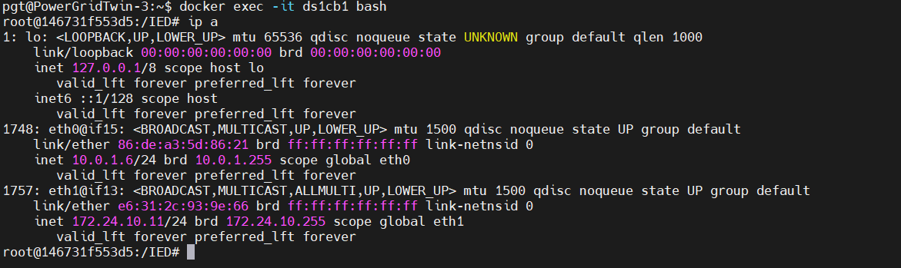

## Docker Container Interfaces

- `ip a` inside the docker container of an IED after `docker exec -it ds1cb1 bash`:

Different use cases of the 2 network interfaces:

1. `eth0 : 10.0.1.6/24`

   - Default interface created when the container is attached to a Docker network (bridge, overlay, or custom)
     **Use case:**
     - Used for container-to-container communication inside the same Docker network
     - Other containers on the same network (subnet `10.0.1.0/24`) can reach this container via `10.0.1.6`
     - Not directly routable from the host machine unless you expose ports (via `-p host_port:container_port`)
       **Example:**
     - If you have another container on the same Docker network, it can `ping 10.0.1.6` or connect directly to its services.

2. `eth1 : 172.24.10.11/24`
   - A second interface — likely because you attached this container to another Docker network (such as with `--network` flag or via Docker Compose multiple networks)
     **Use case:**
     - Provides connectivity to containers/services on the `172.24.10.0/24` subnet
     - Might be used for external integration (such as simulating a "backend network" while `eth0` handles a "frontend network")
     - Useful in multi-network setups, where a container acts as a bridge between 2 networks
       **Example:**
     - If you are running a database container on the `172.24.10.0/24` network, this container can talk to it via `172.24.10.x`

### Which IP can you use from the host machine?

- Normally, you don't use these internal container IPs from the host.
- Instead:
  - Use localhost (127.0.0.1) on the host with port mappings (-p 8080:80)
  - If using **macvlan/host networks**, the container may be directly reachable on one of these IPs (`10.0.1.6` or `172.24.10.11`) from the host or even other machines on the LAN.

### Summary:

- `eth0 (10.0.1.6) ` : main Docker network, container-to-container communication.
- `eth1 (172.24.10.0) `: secondary Docker network, used if container needs to talk to another isolated group of services.
- From the host, you usually connect via `localhost `+ published ports, unless you intentionally configured a special network (macvlan, host, overlay).

To check if these IPs are reachable directly from host or internal-only :

...to be continued...
