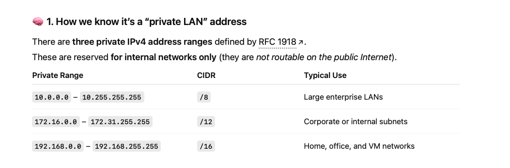

## Docker Macvlan Network 

A macvlan nerwork allows each Docker container to appear on the same Layer 2 network as your host (Ubuntu VM).

- Each container gets its **own unique IP address** on your **physical LAN** (e.g. 192.168.30.x)

- The containers can be reached directly by other devices on that LAN - without NAT.

Because of that, the macvlan network must be bound to your host's physical network interface (the one actually connected to your LAN or VM bridge).


## 🧩 2️⃣ Choosing the correct interface to create Mavvlan network 

*ip a output*


```
ubuntu@pgt:~$ ip a
1: lo: <LOOPBACK,UP,LOWER_UP> mtu 65536 qdisc noqueue state UNKNOWN group default qlen 1000
    link/loopback 00:00:00:00:00:00 brd 00:00:00:00:00:00
    inet 127.0.0.1/8 scope host lo
       valid_lft forever preferred_lft forever
    inet6 ::1/128 scope host 
       valid_lft forever preferred_lft forever
2: enp0s3: <BROADCAST,MULTICAST,UP,LOWER_UP> mtu 1500 qdisc fq_codel state UP group default qlen 1000
    link/ether 08:00:27:62:7e:2a brd ff:ff:ff:ff:ff:ff
    inet 192.168.30.60/24 brd 192.168.30.255 scope global enp0s3
       valid_lft forever preferred_lft forever
    inet6 fe80::a00:27ff:fe62:7e2a/64 scope link 
       valid_lft forever preferred_lft forever
3: docker0: <NO-CARRIER,BROADCAST,MULTICAST,UP> mtu 1500 qdisc noqueue state DOWN group default 
    link/ether 52:18:4f:1d:0b:aa brd ff:ff:ff:ff:ff:ff
    inet 172.17.0.1/16 brd 172.17.255.255 scope global docker0
       valid_lft forever preferred_lft forever
    inet6 fe80::5018:4fff:fe1d:baa/64 scope link 
       valid_lft forever preferred_lft forever
ubuntu@pgt:~$ 
```

From your ip a output:

2: enp0s3: <BROADCAST,MULTICAST,UP,LOWER_UP>

    inet 192.168.30.60/24

✅ enp0s3 is UP, has a valid IPv4 (192.168.30.60/24), and is your main interface connected to the external network.

That makes enp0s3 the correct interface to use for a macvlan network.

The others:

lo — loopback (ignore)

docker0 — Docker’s internal bridge (not physical, so not usable for macvlan)

So yes, you should use enp0s3 for your macvlan setup.




There are three private IPv4 address ranges defined by RFC 1918.
These are reserved for internal networks only (they are not routable on the public Internet).

| Private Range                     | CIDR  | Typical Use                   |
| --------------------------------- | ----- | ----------------------------- |
| `10.0.0.0` – `10.255.255.255`     | `/8`  | Large enterprise LANs         |
| `172.16.0.0` – `172.31.255.255`   | `/12` | Corporate or internal subnets |
| `192.168.0.0` – `192.168.255.255` | `/16` | Home, office, and VM networks |


ubuntu@pgt:~$ ip route

default via 192.168.30.1 dev enp0s3 proto static 

172.17.0.0/16 dev docker0 proto kernel scope link src 172.17.0.1 linkdown 

192.168.30.0/24 dev enp0s3 proto kernel scope link src 192.168.30.60 

ubuntu@pgt:~$ 
