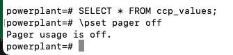

## Using Postgresql DB from docker-compose.yml

```
services:
  postgres:
    image: postgres:16
    container_name: ccp-multi-ied-multi-plc-pg
    environment:
      POSTGRES_USER: root
      POSTGRES_PASSWORD: root
      POSTGRES_DB: powerplant
    ports:
      - "5432:5432"
    volumes:
      - postgres_data:/var/lib/postgresql/data # persistent volume for DB data
      - ./postgres-sql:/docker-entrypoint-initdb.d # init scripts

volumes:
  postgres_data: # named volume definition
```

Got it ✅ — you’ve already defined your PostgreSQL service with user root, password root, and database powerplant.

Once you get a bash shell inside the container, you can access PostgreSQL using the psql client. Here’s how:

1. Get into the container’s shell
`docker exec -it ccp-multi-ied-multi-plc-pg bash`

To enter PostgreSQL:

`psql -U root -d powerplant`

will prompt for a password -> type `root` based on docker-compose.yml used

Once insde psql, you will see something like:

`powerplant=#`

Now you can run SQL commands:

```
\l           -- list databases
\c powerplant -- connect to powerplant DB
\dt          -- list tables
SELECT * FROM ref;
SELECT * FROM ccp_values;
```

💡 Optional tips and customizations
1️⃣ Disable the pager temporarily

If you just want to see everything inline for one session:

\pset pager off




1. run postgresql db as a docker container :
inside ccp_multi_IED_multi_plc_database_pg folder :
docker compose up -d
2. go into postgresql db :
docker exec -it ccp-multi-ied-multi-plc-pg bash
psql -U root -d powerplant
password: root
to show tables : \dt
SELECT * FROM ccp_values;
3. figure out how to connect to matlab using JDBC data source -> configure JDBC data source ...connector for postgresql (driver) 
 
data source name : Postgres_CCP
database name : powerplant
server: localhost
port number : 5432 
 
currently on postgres: 16 and java 8+ 
 
👉 So you should use the JDBC 4.2 driver (version 42.7.8, latest stable). That means: postgresql-42.7.8.jar is the right driver for you.
check what the xsteam is for ... and whether it needs to be changed
try running with the postgresql db -> what is the next part that needs to be connected
check whether IED scripts need to change part at establish_connection() ... conn = mysqlconnector.connect( ....


 
XSteam.m , XSteamUS.m , license.txt , X Steam for Matlab.pdf 
 
previously for a JDBC data source on matlab that used mysql database , on the HOME tab, I had done these: I selected 'Set Path' , 'Add Folder' and then selected xsteam folder  which contained these 4 files , will it make sense to add this same path to the same folder after I changed database to postgresql but im using it for the same functionality ? what is the xsteam folder for and does any of the files in it need to be modified ?
 
XSteam folder and files belong to an independent MATLAB library called XSteam, used to calculate thermodynamic properties of water and steam (e.g. enthalpy, entropy, temperature, pressure-volume relationships, steam quality etc. )
 
3. in stored_procedure_pg_GT.sql -> timestamp was changed to ts as timestamp is a reserved keyword in postgresql
 
need to check if it affects anything in the IEDs or PLCs for GT
 
check the changes needed for the IED files
 
 
Since you’ve switched from MySQL to PostgreSQL, you can’t use mysql.connector anymore. You need to use a PostgreSQL driver, like psycopg2 or psycopg.
Here’s how you can modify your function:
```
import psycopg2  # PostgreSQL driver

def establish_connection():
    conn = psycopg2.connect(
        host="10.34.11.15",        # your PostgreSQL host
        port=5432,                  # default PostgreSQL port
        user="root",                # your PostgreSQL username
        password="root",            # your PostgreSQL password
        database="powerplant"       # your PostgreSQL database name
    )
    return conn
```

Key Changes:

1. Driver: Use psycopg2 instead of mysql.connector.
2. Port: PostgreSQL default is 5432 (MySQL default is 3306).
3. SQL syntax: Some queries may need slight changes if they use MySQL-specific syntax (e.g., backticks `table` vs. double quotes "table" in PostgreSQL), but most simple SELECT statements are fine.
4. Stored procedures/functions:

In PostgreSQL, your stored procedures are functions, so you’ll call them differently:
```
cur = conn.cursor()
cur.execute("SELECT * FROM get_gt_ied_data();")  # note the parentheses
rows = cur.fetchall()
```


Excellent — yes, you’re thinking of **`psql`'s display and output behavior settings**, and there *is* a way to make it show query results, then immediately return to the prompt without odd pauses or output paging.

Let’s go through this cleanly 👇

---

### 🎯 Problem

When you run a command in `psql`, sometimes:

* It pauses after showing output (especially for long results).
* Or it pipes output through a pager like `less`, requiring you to press `q` to get back.
* Or you want it to just print everything directly and go back to the prompt.

---

Excellent — yes, you’re thinking of psql's display and output behavior settings, and there is a way to make it show query results, then immediately return to the prompt without odd pauses or output paging.

Let’s go through this cleanly 👇

### ✅ Solution — Disable the pager and control display settings

You can use these `psql` internal commands:

#### 1. **Disable the pager (so output prints immediately)**

```sql
\pset pager off
```

This ensures query results are shown directly in the terminal, **and you return immediately** to the `powerplant=#` prompt after the output.

If you want to **re-enable** it later:

```sql
\pset pager on
```

You can check its status:

```sql
\pset
```

---

#### 2. **Disable formatting for simpler plain output**

If you want more compact output (no table borders or alignment):

```sql
\pset format unaligned
\pset border 0
```

Then results will appear like plain text (useful for scripts or logs).

Restore normal table output with:

```sql
\pset format aligned
\pset border 1
```

---

#### 3. **Disable headers or footers (optional)**

If you don’t want to see the `(3 rows)` line:

```sql
\pset footer off
```

To bring it back:

```sql
\pset footer on
```

---

#### 4. **Make settings permanent**

To persist these preferences, add them to your `~/.psqlrc` file:

```bash
echo '\pset pager off' >> ~/.psqlrc
echo '\pset format aligned' >> ~/.psqlrc
echo '\pset border 1' >> ~/.psqlrc
```

Then they’ll apply automatically every time you start `psql`.

---

### 🧠 Example session

```bash
psql -U root -d powerplant
```

Inside `psql`:

```sql
\pset pager off
\pset format aligned
select * from ccp_values limit 5;
```

➡ Output prints immediately
➡ Cursor returns cleanly to `powerplant=#`

---

Would you like me to suggest an *optimal `.psqlrc` configuration* for smooth day-to-day work (no pauses, clean formatting, and instant results)?
