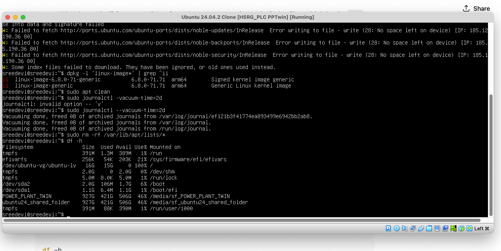
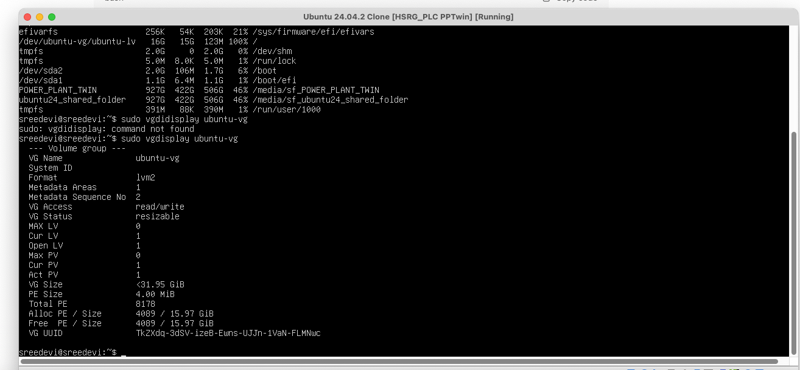

##At GRUB Shell:

🔧 Steps to boot into text console
At the grub> prompt, run these exact commands:
```
set root=(hd0,gpt2)

linux /vmlinuz root=/dev/ubuntu-vg/ubuntu-lv ro systemd.unit=multi-user.target

initrd /initrd.img

boot
```

📌 Explanation

- set root=(hd0,gpt2) → tells GRUB where /boot is.

- linux /vmlinuz root=/dev/ubuntu-vg/ubuntu-lv ro systemd.unit=multi-user.target

- /vmlinuz → your kernel (symlink to latest: vmlinuz-6.8.0-71-generic).

- root=/dev/ubuntu-vg/ubuntu-lv → because your root filesystem is inside LVM (lvm/ubuntu--vg-ubuntu--lv showed up in your ls).

- systemd.unit=multi-user.target → boots into text console instead of GUI.
- initrd /initrd.img → loads your initramfs.
- boot → starts the kernel.

🖥️ After booting
You’ll land in a text login prompt.
Login with your username/password.
Then fix the problematic services:

```
sudo systemctl disable NetworkManager-wait-online.service
sudo systemctl mask NetworkManager-wait-online.service
sudo apt update
sudo apt install --reinstall gdm3 virtualbox-guest-utils virtualbox-guest-x11 virtualbox-guest-dkms
sudo systemctl set-default multi-user.target
```

Reboot:
```
sudo reboot
```

You should now get a stable text login every time.
Once everything is fixed, you can switch back to GUI with:

```
sudo systemctl set-default graphical.target
sudo systemctl isolate graphical.target
```


## Checking space left on VM:

```
↑ Share se into data and signature falled 
Ubuntu 24.04.2 Clone [HSRG_PLC PPTwin] [Running] 
W: Failed to fetch http://ports.ubuntu.com/ubuntu-ports/dists/noble-updates/InRelease 
Error writing to file - write (28: No space left on device) [IP: 185.12 190.36 80] 
W: Failed to fetch http://ports.ubuntu.com/ubuntu-ports/dists/noble-backports/InRelease Error writing to file write (28: No space left on device) [IP: 185. 5.190.36 80] 
W: Failed to fetch http://ports.ubuntu.com/ubuntu-ports/dists/noble-security/InRelease Error writing to file - write (28: No space left on device) [IP: 185.1 .190.36 80] 
W: Some index files failed to download. They have been ignored, or old ones used instead. 
sreedevi@sreedevi:~$ dpkg -1 'linux-image*' | grep ^ii ii 
linux-image-6.8.0-71-generic ii  6.8.0-71.71 arm64 Signed kernel image generic
linux-image-generic 6.8.0-71.71 arm64 Generic Linux kernel image
sreedevi@sreedevi :~$ sudo apt clean      
sreedevi@sreedevi:~$ sudo journalctl -vacuum-time=2d 
journalctl: invalid option -- 'v' 
sreedevi@sreedevi :~$ sudo journalctl --vacuum-time=2d 
Vacuuming done, freed B of archived journals from /var/log/journal/ef 121b3f41774ea893499e6942bb2ab8. 
Vacuuming done, freed B of archived journals from /var/log/journal. 
Vacuuming done, freed B of archived journals from /run/log/journal. 
sreedevi@sreedevi:~$ sudo rm -rf /var/lib/apt/lists/* 
sreedevi@sreedevi: "$ df -h 
Filesystem Size Used Avail Use% Mounted on 
tmpfs 391M 1.3M 389M 1% /run 
efivarfs 256K 54K 203K 21% /sys/firmware/efi/efivars 
/dev/ubuntu-vg/ubuntu-lv 16G 15G Ø 100% / 
tmpfs 2.0G Ө 2.0G 0% /dev/shm
tmpfs 5.0M 8.0K 5.0M 1% /run/lock 
/dev/sda2 2.0G 106M 1.7G 6% /boot 
/dev/sda1 1.1G 6.4M 1.1G 1% /boot/efi 
POWER PLANT_TWIN 927G 421G 506G 46% /media/sf_POWER_PLANT_TWIN 
ubuntu24_shared_folder 927G 421G 506G 46% /media/sf_ubuntu24_shared_folder 
tmpfs 391M 88K 390M 1% /run/user/1000 
sreedevi@sreedevi:~$
```





- Your root filesystem is:
/dev/ubuntu-vg/ubuntu-lv   16G   15G   0   100%   /
So your root volume is 16 GB and completely full. That’s why apt fails and the VM hangs.
Your /boot and /boot/efi partitions have space, but they don’t help since all system packages/logs live under /.


## Free some emergency space
Just enough so apt and the system can breathe:

```

# Clear apt cache (already done, but run again just in case)
sudo apt clean

# Remove old logs
sudo rm -rf /var/log/journal/*

# Truncate big logs if they exist
sudo truncate -s 0 /var/log/*.log
sudo truncate -s 0 /var/log/*/*.log
```


## Check if there is free space in the volume group

```
sreedevi@sreedevi:~$ sudo vgdisplay ubuntu-vg 

Volume group 

VG Name ubuntu-vg 
System ID 
Format 1vm2 
Metadata Areas 1 
Metadata Sequence No 2 
VG Access read/write 
VG Status resizable 
MAX LV Ө 
Cur LV 1 
Open LV 1 
Max PV Ө 
Cur PV 1 
Act PV 1 
VG Size <31.95 GiB 
PE Size 4.00 MiB 
Total PE 8178 
Alloc PE Size 4089 / 15.97 GiB 
Free PE Size 4089/15.97 GiB 
VG UUID TkZXdq-3dSV-izeB-Ewns-UJJn-1VaN-FLMNwc 
sreedevi@sreedevi:~$
```



This means the volume group `ubuntu-vg` is ~32 GB total, but only 16 GB is allocated to `/` (`/dev/ubuntu-vg/ubuntu-lv`).
So this means you already have **~16GB free inside the VG ready to use** - you don't even need to resize the VirtualBox disk.


## Expand your root filesystem

Run these 2 commmands:
```
# Extend root LV to use all free space
sudo lvextend -l +100%FREE /dev/ubuntu-vg/ubuntu-lv

# Resize filesystem to fill LV
sudo resize2fs /dev/ubuntu-vg/ubuntu-lv
```

```
sreedevi@sreedevi:~$ sudo lvextend -1 +100%FREE /dev/ubuntu-vg/ubuntu-lv 
[sudo] password for sreedevi: 
Size of logical volume ubuntu-vg/ubuntu-lv changed from 15.97 GiB (4089 extents) to <31.95 GiB (8178 extents). 
Logical volume ubuntu-vg/ubuntu-lv successfully resized. 
sreedevi@sreedevi :~$ sudo resize2fs /dev/ubuntu-vg/ubuntu-lv resize2fs 1.47.0 (5-Feb-2023) 
Filesystem at /dev/ubuntu-vg/ubuntu-ly is mounted on ; on-line resizing required old_desc_blocks = 2, new_desc_blocks = 4 
The filesystem on /dev/ubuntu-vg/ubuntu-lv is now 8374272 (4k) blocks long. 
sreedevi@sreedevi: df -h 
Filesystem Size Used Avail Use% Mounted on 
tmpfs 391M 1.3M 389M 1% /run 
efivarfs 256K 54K 203K 21% /sys/firmware/efi/efivars 
/dev/ubuntu-vg/ubuntu-lv 32G 15G 16G 50% / 
tmpfs 2.0G Ө 2.0G 0% /dev/shm 
tmpfs 5.0м 8.ок 5.0м 1% /run/lock 
/dev/sda2 2.0G 106M 1.7G 6% /boot 
/dev/sda1 1.1G 6.4M 1.1G 1% /boot/efi 
POWER PLANT_TWIN 927G 422G 506G 46% /media/sf_POWER_PLANT_TWIN 
ubuntu24_shared_folder 927G 422G 506G 46% /media/sf_ubuntu24_shared_folder 
tmpfs 391M 88K 390M 1% /run/user/1000 
sreedevi@sreedevi:~$
```


issue faced when trying steps 

```
sreedevi@sreedevi :~$ sudo apt install --reinstall gdm3 virtualbox-guest-utils virtualbox-guest-x11 virtualbox-guest-dkms. 
Reading package lists... 
Done Building dependency tree... 
Done Reading state information... 
Done E: Unable to locate package virtualbox-guest-utils 
E: Unable to locate package virtualbox-guest-x11 
E: Unable to locate package virtualbox-guest-dkms 
sreedevi@sreedevi: "$ 
```

Steps to fix boot delay from "waiting for network online" and reconfigure GDM for next boot: 

sudo systemctl disable NetworkManager-wait-online.service 
sudo systemctl mask NetworkManager-wait-online.service 
sudo apt update 
sudo apt install spice-vdagent virtualbox-guest-additions-iso
sudo systemctl set-default multi-user.target 

sudo systemctl set-default graphical.target # switching to GUI


**Prompt from me:**
After Select Advanced options for Ubuntu → recovery mode. Choose Root – Drop to root shell prompt. the prompt says enter for maintenance and press control D to continue after I pressed control d I see `root@sreedevi` how should I proceed to do these : sudo systemctl disable NetworkManager-wait-online.service sudo systemctl mask NetworkManager-wait-online.service sudo apt update sudo apt install virtualbox-guest-utils virtualbox-guest-x11 virtualbox-guest-dkms sudo dpkg-reconfigure gdm3


If root filesystem is mounted as read-only :
`mount -o remount,rw /`

After Select Advanced options for Ubuntu -> recovery mode 


